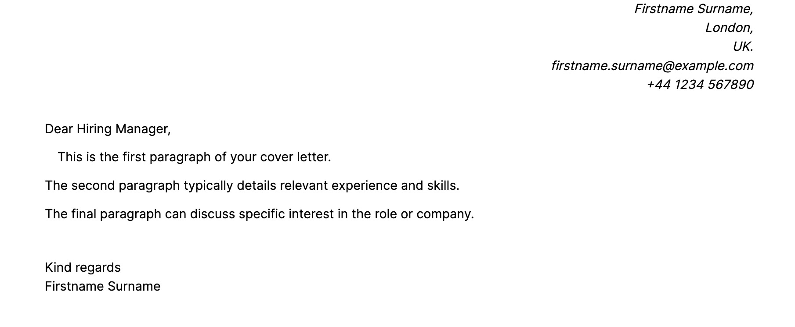
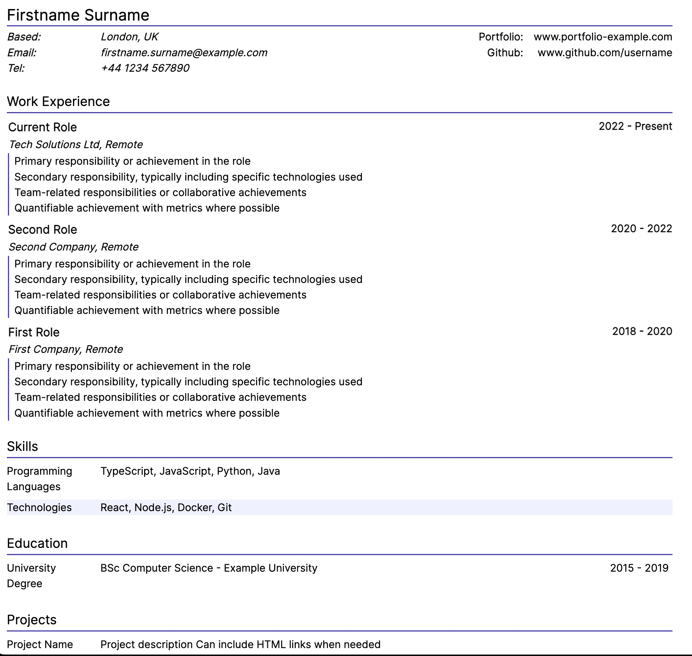

# CV Server

A TypeScript-based CV rendering system that fetches CV data from a GitHub repository and renders it as a responsive web page. Built with Vite, Tailwind CSS, and deployable on Netlify.

## Features

- Responsive design with Tailwind CSS
- Secure data fetching from private GitHub repositories
- Print-friendly styling
- Comprehensive test coverage with Vitest
- Easy deployment with Netlify
- CI/CD pipeline with GitHub Actions

## Prerequisites

- Node.js 20.x
- npm
- A GitHub account with a private repository for CV data
- A GitHub Personal Access Token (instructions below)
- Netlify account (for deployment)

## Setting up GitHub Personal Access Token

To access private repositories, you'll need a GitHub Personal Access Token (PAT):

1. Go to GitHub.com and sign in
2. Click your profile picture in the top right
3. Go to Settings > Developer settings > Personal access tokens > Tokens (classic)
4. Click "Generate new token (classic)"
5. Name your token something meaningful like "CV Server Access"
6. Set the expiration as needed
7. Select only these permissions:
   - `repo` - Full control of private repositories
   OR if you prefer minimal permissions:
   - `repo:status`
   - `repo_deployment`
   - `public_repo`
   - `repo:invite`
   - `security_events`
8. Click "Generate token"
9. Copy the token immediately - you won't be able to see it again!

**Important Note About Token Expiration**: When your Personal Access Token expires, the CV server will be unable to fetch data from GitHub, resulting in a blank page. Make sure to:
- Set a calendar reminder before the token expires
- Generate and update the token in your environment variables before expiration
- Consider using a longer expiration time for production deployments

## Getting Started

1. Clone the repository:
```bash
git clone <your-repo-url>
cd cv-server
```

2. Install dependencies:
```bash
npm install
```

3. Set up environment variables:
Create a `.env` file in the root directory with the following variables:
```env
GITHUB_USERNAME=your-username
GITHUB_REPO=your-cv-data-repo
GITHUB_API_KEY=your-github-personal-access-token
GITHUB_REPO_DIRECTORY=optional/subdirectory
GITHUB_REPO_FILENAME=cv-data.json
```

4. Start the development server:
```bash
npm run dev
```

## Project Structure

```
src/
├── GitHubRepoDataStore/    # GitHub data fetching implementation
├── frontend/               # Frontend components and rendering logic
│   ├── sections/          # CV section components
│   └── renderPage/        # Main page rendering logic
├── lib/                   # Utility functions and helpers
├── types/                 # TypeScript type definitions
└── tailwind/             # Tailwind CSS configuration and utilities
```

## Strategic Benefits

### Git-Based CV Management
- Store different versions of your CV for different roles/employers using Git branches
- Track changes to your CV over time with full version control
- Easily revert changes or merge updates across different versions
- Use Git's branching strategy to maintain multiple versions:
   - Keep a `main` branch with your full, generic CV
   - Create branches for specific companies or roles
   - Cherry-pick relevant experience and tailor content for each application
   - Maintain a history of all your applications and iterations

**Important Note About Branch Names**:
The branch name becomes part of the final URL (e.g., `cv.example.com/branch-name`). Choose professional, clean branch names that you're comfortable sharing with employers. For example:
- ✓ `canonical` - Good for your main/default CV
- ✓ `frontend-dev` - Good for a role-specific CV
- ✓ `tech-lead-2024` - Good for a specific position
- ✗ `company-name` - Avoid using employer names in branches
- ✗ `quick-draft` - Avoid temporary/working branch names

### Private Data Management
- Keep your CV data private in a separate GitHub repository
- Share only the rendered version, not your personal data
- Update contact details or personal information in one place
- Control access to your raw CV data while keeping the rendering code open source

## Output Format

The CV server generates two main pages:

1. A cover letter page that includes:
   - Your contact details in a right-aligned header
   - A formal letter format with greeting, body paragraphs, and sign-off
   - Professional spacing and typography



2. A CV page that includes:
   - Your name and contact details in a clean header
   - Work experience with indented content and clear date positioning
   - Skills and education in a structured format
   - Project links and descriptions



Both pages are designed to be responsive and printer-friendly (looks great as a PDF too), using Tailwind CSS for styling.

## CV Data Format

### Schema

The CV data should be stored in your GitHub repository as a JSON file with the following structure:

```typescript
interface CV {
    user: UserData;
    coverLetter: CoverLetter;
    experienceSection: Experience;
    sections: General[];
}
```

### Example JSON

Here's a complete example of the expected data structure (remove comments in your live version)

```json
{
    "user": {
        "name": "Firstname Surname",
        "location": {
            // City name or "Remote"
            "city": "London",
            "country": "UK"
        },
        "contact": {
            // International format recommended
            "phone": "+44 1234 567890",
            "email": "firstname.surname@example.com"
        },
        // Professional links shown in header
        "links": [
            {
                // Display name for the link
                "title": "Portfolio",
                // Must include https://
                "url": "https://www.portfolio-example.com"
            },
            {
                "title": "Github",
                "url": "https://www.github.com/username"
            }
        ]
    },
    "coverLetter": {
        "greeting": "Dear Hiring Manager",
        // Each array item becomes a paragraph
        "text": [
            "This is the first paragraph of your cover letter.",
            "The second paragraph typically details relevant experience and skills.",
            "The final paragraph can discuss specific interest in the role or company."
        ],
        "signOff": "Kind regards"
    },
    "experienceSection": {
        "title": "Work Experience",
        "items": [
            {
                "title": "Current Role",
                "business": {
                    "title": "Tech Solutions Ltd",
                    "link": "https://www.techsolutions-example.com",
                    "location": {
                        "city": "Remote",
                        "country": "UK"
                    },
                    "department": "Engineering"
                },
                "dates": "2022 - Present",
                "content": [
                    "Primary responsibility or achievement in the role",
                    "Secondary responsibility, typically including specific technologies used",
                    "Team-related responsibilities or collaborative achievements",
                    "Quantifiable achievement with metrics where possible"
                ]
            },
            {
                "title": "Second Role",
                "business": {
                    "title": "Second Company",
                    "link": "https://www.second-company-example.com",
                    "location": {
                        "city": "Remote",
                        "country": "UK"
                    },
                    "department": "Development"
                },
                "dates": "2020 - 2022",
                "content": [
                    "Primary responsibility or achievement in the role",
                    "Secondary responsibility, typically including specific technologies used",
                    "Team-related responsibilities or collaborative achievements",
                    "Quantifiable achievement with metrics where possible"
                ]
            },
            {
                "title": "First Role",
                "business": {
                    "title": "First Company",
                    "location": {
                        "city": "Remote",
                        "country": "UK"
                    },
                    "department": "Technology"
                },
                "dates": "2018 - 2020",
                "content": [
                    "Primary responsibility or achievement in the role",
                    "Secondary responsibility, typically including specific technologies used",
                    "Team-related responsibilities or collaborative achievements",
                    "Quantifiable achievement with metrics where possible"
                ]
            }
        ]
    },
    // Additional flexible sections
    "sections": [
        {
            "title": "Skills",
            "items": [
                {
                    "title": "Programming Languages",
                    // Commas in content are rendered as provided
                    "content": [
                        // Include trailing comma if desired
                        "TypeScript,",
                        "JavaScript,",
                        "Python,",
                        // Last item without comma
                        "Java"
                    ]
                },
                {
                    "title": "Technologies",
                    "content": [
                        "React,",
                        "Node.js,",
                        "Docker,",
                        "Git"
                    ]
                }
            ]
        },
        {
            "title": "Education",
            "items": [
                {
                    "title": "University Degree",
                    // Can include HTML if needed
                    "content": [
                        "BSc Computer Science - Example University"
                    ],
                    // Optional in general sections
                    "dates": "2015 - 2019"
                }
            ]
        },
        {
            "title": "Projects",
            "items": [
                {
                    "title": "Project Name",
                    // Optional project link
                    "link": "https://github.com/username/project",
                    "content": [
                        "Project description",
                        // HTML supported
                        "Can include <a href='https://example.com'>HTML links</a> when needed"
                    ]
                }
            ]
        }
    ]
}
```

Note: The actual TypeScript interfaces for this structure can be found in `src/types/CV/CV.ts`. The system will validate your JSON against these types at runtime.


## Development

### Available Scripts

- `npm run dev` - Start development server with Netlify dev
- `npm run build` - Build for production
- `npm run test` - Run all tests
- `npm run testint` - Run integration tests only
- `npm run lint` - Run ESLint
- `npm run format` - Format code with Prettier

### Testing

The project uses Vitest for testing, with separate configurations for unit and integration tests:

- Unit tests: `npm run vitest-unit-only`
- Integration tests: `npm run vitest-integration-only`
- All tests: `npm run vitest-all`

### Code Style

The project uses:
- ESLint for code linting
- Prettier for code formatting
- TypeScript for type safety
- Tailwind CSS for styling

## Deployment

The project is configured for deployment on Netlify:

1. Connect your repository to Netlify
2. Configure environment variables in Netlify's dashboard
3. Deploy using the included `netlify.toml` configuration
